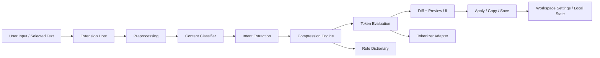

# Architecture

## Overview

This project is a VS Code extension that compresses coding prompts locally, reduces token usage, and preserves the original intent as much as possible without relying on cloud AI services.

The extension is designed around a deterministic, offline-first pipeline. It does not try to "think" like a large language model. Instead, it analyzes the prompt, identifies structure and intent patterns, applies safe rewrite rules, and measures the result with a local tokenizer.

The system should be fast, transparent, and auditable.

## Core goals

- Work fully offline for the core compression flow
- Reduce token count without losing critical meaning
- Preserve technical constraints and identifiers
- Be safe for coding workflows
- Show the user exactly what changed
- Support future expansion without rewriting the core

## Architectural principles

### 1. Rules first
The system is built on deterministic rules, not AI inference. Every rewrite should be explainable and testable.

### 2. Structure aware
The extension should treat prose, code, JSON, logs, and diffs differently.

### 3. Token aware
Compression decisions should be measured with a local tokenizer, not guessed from character count alone.

### 4. Safe by default
The extension must avoid modifying critical technical content such as identifiers, version numbers, file paths, URLs, and code blocks unless explicitly allowed.

### 5. Transparent output
The user should always be able to see:
- original text
- compressed text
- token count before and after
- applied compression level
- what changed

## High-level architecture



## Main components

## 1. Extension Host

Responsible for:
- registering VS Code commands
- reading editor selection or input text
- opening webview panels
- coordinating the compression pipeline
- loading project settings and local rules

Example commands:
- `extension.openPromptOptimizer`
- `extension.compressSelection`
- `extension.compressClipboardPrompt`
- `extension.previewCompressionDiff`

## 2. Preprocessing Layer

This stage prepares raw text for analysis.

Responsibilities:
- normalize whitespace
- normalize punctuation where safe
- unify common phrases
- mark protected regions
- detect obvious repeated segments

Examples:
- collapse repeated spaces
- normalize smart quotes to plain quotes where useful
- standardize contractions only if safe
- identify fenced code blocks

Output:
- normalized text
- protected ranges
- preprocessing metadata

## 3. Content Classifier

Determines what kind of content is being compressed.

Supported types:
- prose prompt
- code context
- JSON / config
- logs / stack traces
- git diff / patch
- mixed content

This is important because each type needs different compression rules.

Example:
- prose can remove filler
- code context must preserve identifiers
- logs may compress repeated timestamps or boilerplate
- JSON may remove unnecessary spacing but not keys

## 4. Intent Extraction Layer

The goal is not full semantic understanding. The goal is structured interpretation.

This layer extracts:
- action
- target
- goals
- constraints
- response format
- stack context

Example input:
"Please refactor this React component, keep behavior the same, do not add dependencies, and explain first."

Extracted structure:
- action: refactor
- target: React component
- constraints:
  - preserve behavior
  - no new deps
- response style:
  - explain before code

This layer is powered by:
- pattern matching
- dictionaries
- canonical phrase mapping
- optional fuzzy matching

## 5. Compression Engine

This is the heart of the system.

It applies ordered transformations such as:
- filler removal
- repeated phrase elimination
- canonical phrase replacement
- structural shortening
- deduplication
- budget-aware compaction

Compression modes:
- Safe
- Balanced
- Aggressive

Each rule should declare:
- id
- category
- target content type
- match condition
- replacement behavior
- safety level

## 6. Token Evaluation Layer

After each major compression step, the extension evaluates token usage.

Responsibilities:
- count tokens before and after
- compare against target budget
- decide whether another pass is needed
- expose quality mode to UI

Possible modes:
- exact
- near-exact
- approximate fallback

The tokenizer layer should be replaceable.

## 7. Diff + Preview UI

The UI should build trust.

It should display:
- original prompt
- compressed prompt
- token savings
- percentage reduction
- applied mode
- exact vs approximate token quality
- side-by-side diff or inline diff

Possible actions:
- copy compressed prompt
- replace selected text
- save as template
- mark rule as undesirable
- switch compression level

## 8. Local Knowledge Layer

The extension should remember local preferences.

Storage targets:
- global settings
- workspace settings
- saved aliases
- custom rules
- preferred tokenizer mode
- language / framework profile

Examples of workspace rules:
- preserve public API names
- no new dependencies
- TypeScript only
- explain before code
- minimal edits

## Data flow

### Step 1
User selects or pastes a prompt.

### Step 2
The system preprocesses the text and marks protected zones.

### Step 3
The classifier determines content type.

### Step 4
The intent extractor builds a structured representation.

### Step 5
The compression engine applies safe rules in sequence.

### Step 6
The tokenizer measures token count after each pass.

### Step 7
The UI presents results and lets the user apply or reject them.

## Safety model

The system must never silently destroy critical content.

Protected elements should include:
- code fences
- inline code
- file paths
- URLs
- version numbers
- package names
- function names
- class names
- environment variables
- API endpoints
- quoted error strings

Default policy:
- preserve unless clearly compressible and user-approved

## Extensibility

This architecture should support future additions without changing the core.

Future modules:
- AST-aware code context compression
- language-specific rule packs
- local model integration
- compression quality scoring
- regression testing harness
- prompt templates by framework
- team-shared workspace dictionaries

## Recommended module layout

```text
src/
  extension.ts
  commands/
    openOptimizer.ts
    compressSelection.ts
    previewDiff.ts
  core/
    pipeline.ts
    types.ts
  preprocess/
    normalize.ts
    protectRanges.ts
  classify/
    contentClassifier.ts
  intent/
    extractIntent.ts
    canonicalize.ts
  compress/
    compressEngine.ts
    strategies/
      prose.ts
      codeContext.ts
      json.ts
      logs.ts
      diff.ts
  rules/
    ruleRegistry.ts
    builtins/
      fillerRules.ts
      constraintRules.ts
      actionRules.ts
  tokenizer/
    tokenizerAdapter.ts
    gptTokenizer.ts
    tiktokenAdapter.ts
  ui/
    panel/
      webview.ts
      state.ts
  storage/
    settings.ts
    workspaceRules.ts
  testing/
    fixtures/
    regression/
```

## MVP architecture decision

For version 1:
- TypeScript only
- deterministic rules engine
- content classifier
- local tokenizer
- side-by-side preview
- workspace dictionary

For version 2:
- richer content routing
- deeper technical phrase dictionaries
- optional Rust/WASM tokenizer path
- stronger regression and evaluation suite
